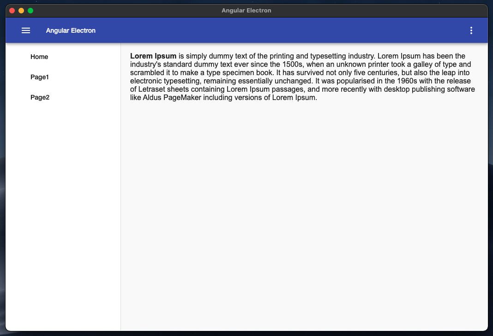

[](https://angular.io/) [](https://electronjs.org/)

[]


# Introduction

Bootstrap and package your project with Angular 7 and Electron (Typescript + SASS + Hot Reload) for creating Desktop applications.

This repository is based on [angular-electron](https://github.com/maximegris/angular-electron) by [Maxime Gris](https://github.com/maximegris) with extra additions the [@angular/material](https://github.com/angular/material2) and [firebase](https://github.com/firebase/firebase-js-sdk) modules.

Currently runs with:

- Angular v11.2.7
- Angular Material v11.2.7
- Firebase v8.3.2
- Electron v12.0.2
- Electron Builder v22.10.5

With this sample, you can :

- Run your app in a local development environment with Electron & Hot reload
- Run your app in a production environment
- Package your app into an executable file for Linux, Windows & Mac

## Getting Started

Clone this repository locally :

``` bash
git clone https://github.com/johnmakridis/angular-electron-starter.git
```

Install dependencies with npm :

``` bash
npm install
```

If you want to generate Angular components with Angular-cli , you **MUST** install `@angular/cli` in npm global context.  
Please follow [Angular-cli documentation](https://github.com/angular/angular-cli) if you had installed a previous version of `angular-cli`.

``` bash
npm install -g @angular/cli
```

## To build for development

- **in a terminal window** -> npm start  

Voila! You can use your Angular + Electron app in a local development environment with hot reload !

The application code is managed by `main.ts`. In this sample, the app runs with a simple Angular App (http://localhost:4200) and an Electron window.  
The Angular component contains an example of Electron and NodeJS native lib import.  
You can disable "Developer Tools" by commenting `win.webContents.openDevTools();` in `main.ts`.

## Browser mode

Maybe you want to execute the application in the browser with hot reload ? You can do it with `npm run ng:serve:web`.  


## Included Commands

|Command|Description|
|--|--|
|`npm run ng:serve`| Execute the app in the browser |
|`npm run build`| Build the app. Your built files are in the /dist folder. |
|`npm run build:prod`| Build the app with Angular aot. Your built files are in the /dist folder. |
|`npm run electron:local`| Builds your application and start electron
|`npm run electron:build`| Builds your application and creates an app consumable based on your operating system |


**Your application is optimised. Only /dist folder and node dependencies are included in the executable.**

## You want to use a specific lib (like rxjs) in electron main thread ?

YES! You can do it! Just by importing your library in npm dependencies section (not devDependencies) with `npm install --save`. It will be loaded by electron during build phase and added to your final package. Then use your library by importing it in `main.ts` file. Quite simple, isn't it?

